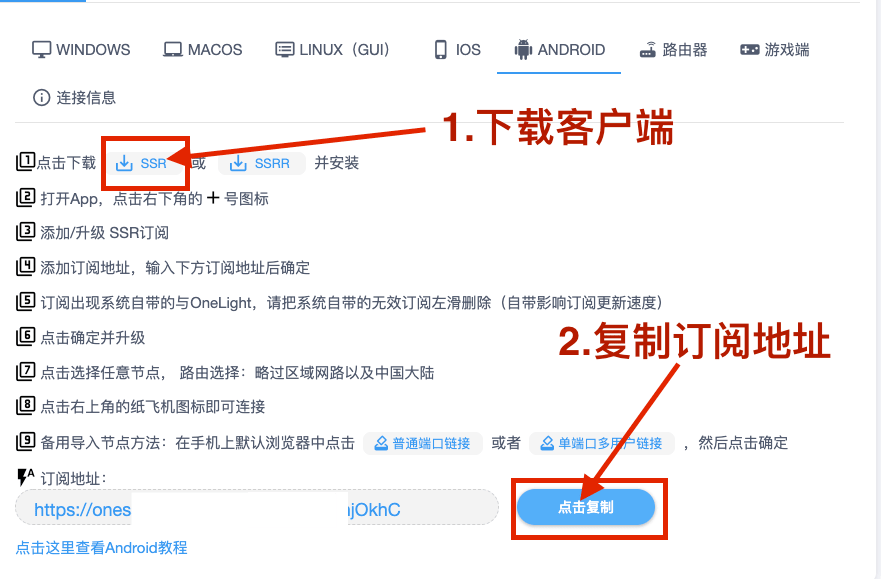
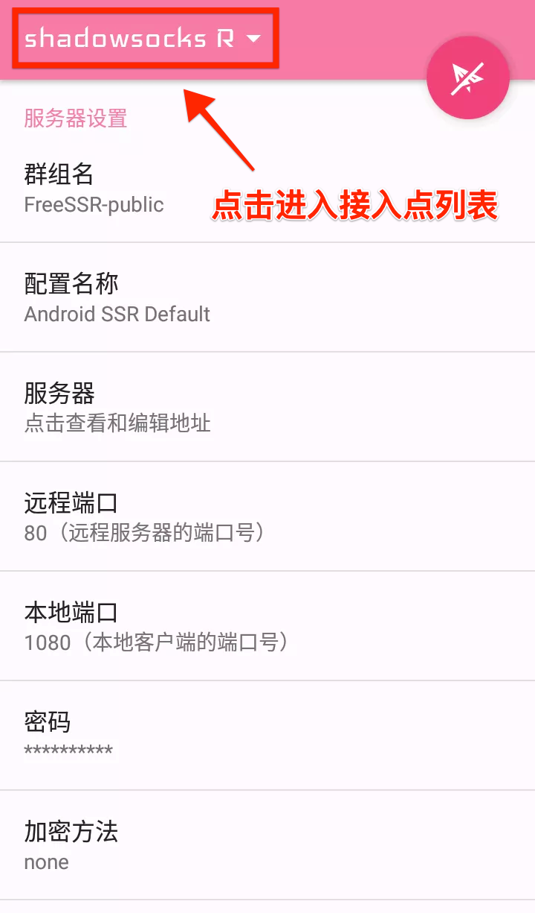
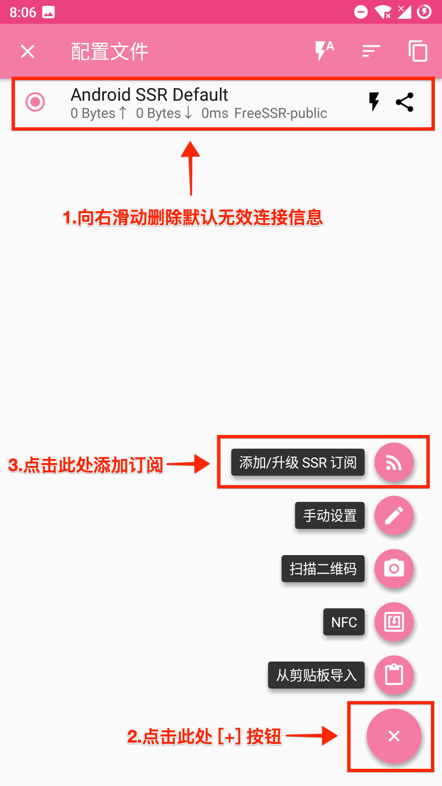
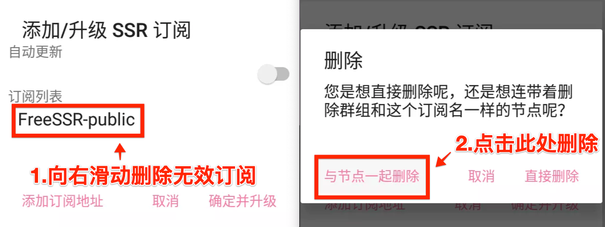
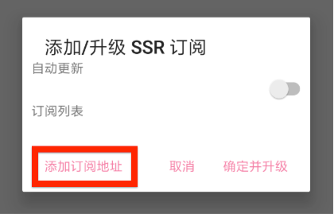
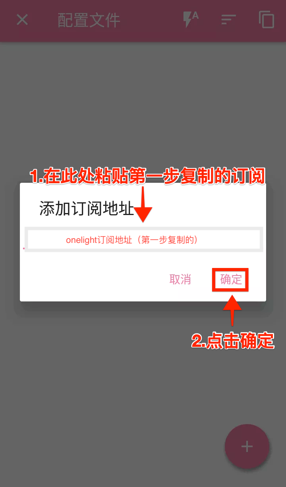
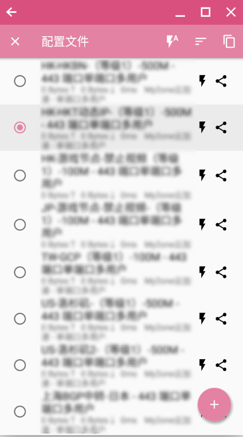
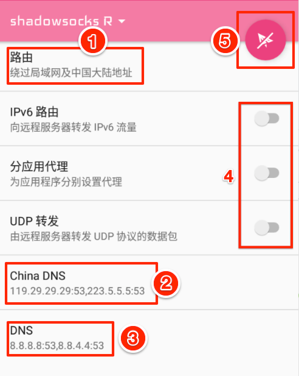

# Android 教程

| 系统 | 软件版本 |
| :--- | :--- |
| Android4.4+ | ShadowsocksR 最新版 |

## 配置订阅节点及使用教程

_完成以下简单配置步骤，即可享用Onelight云服务。\(阁下可能需要花5~10分钟左右的时间完成教程\)_

### 一 .请使用浏览器打开 _OneLight_ 用户中心 - 下载软件并复制订阅地址

#### [传送onelight官网](https://onelight.cloud/user):[https://onelight.cloud/user](https://onelight.cloud/user)

1. 点击下载 Android apk 并安装。
2. 复制订阅地址，配置客户端时需使用


订阅地址包含您的订阅信息，阁下应当把它当做密码一样妥善保管，请勿泄露给他人！


### 二. 打开安装的 ShadowsocksR 应用程序

* 然后点击顶部的**「ShadowsocksR」**区域进入接入点列表。

* 默认有一个**「Android SSR Default」**的无效连接信息，向右滑动将其删除。
* 点击在接入点列表页面底部的**「+」**按钮，并选择**「添加/升级 SSR 订阅」**

* 订阅列表中默认有一个**「FreeSSR-public」**订阅，向右滑动将其删除。
* 在弹出的对话框中点击**「与节点一起删除」**。

* 再次点击接入点列表页面底部的**「+」**按钮，选择**「添加/升级 SSR 订阅」**，在订阅列表中点击**「添加订阅地址」**。

* 长按文本框空白区域，选择**「粘贴」**，将第一步复制的订阅地址粘贴到文本框中。点击**「确定」**
* ShadowsocksR 应用程序显示**「处理中」**。这可能需要一小段时间，具体根据网络情况而定


更新失败与网络环境有关，多次失败建议 4G、WIFI 环境都尝试更新一下。


* 勾选 **自动更新**。
* 点击**「确定并升级」**就可以导入最新的 Onelight 接入点信息并自动更新了。


选择任意带有地区名字的节点使用（到期时间等信息提示节点无法使用）


### 三.分流设置

1. 设置**「路由」**为**「绕过局域网和中国大陆地址」**。
2. 更改**「China DNS」**选项为 **119.29.29.29:53,223.5.5.5:53**
3. 更改**「DNS」**选项为 **8.8.8.8:53,8.8.4.4:53**
4. 将**「IPv6路由」「分应用代理」「UDP转发」**关闭。
5. 全部完成后点击右上角**「纸飞机」**图标连接。

* 如果是首次连接，则系统会弹出如上的提示框，请点击**「确定」**

> #### 现在您可以享受 Onelight云服务 接入点带来的全新国际网络访问体验。

