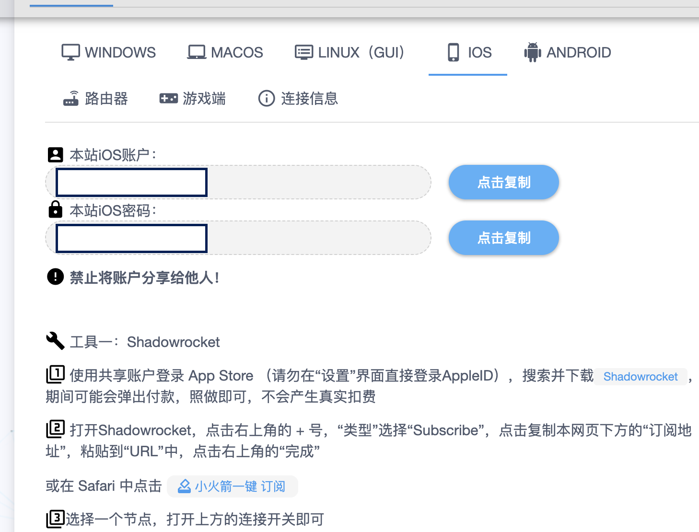
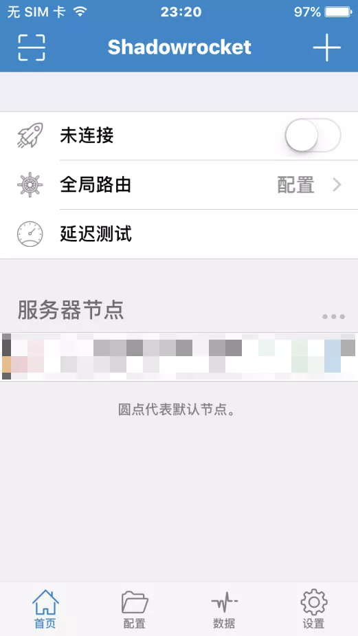
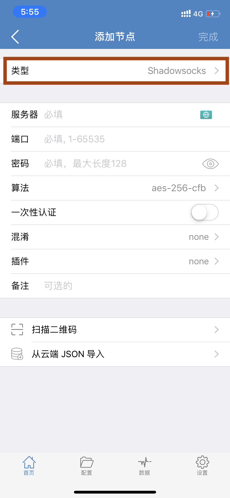
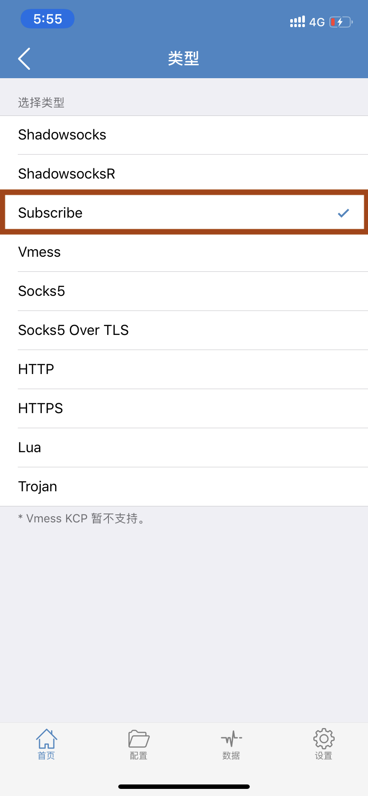
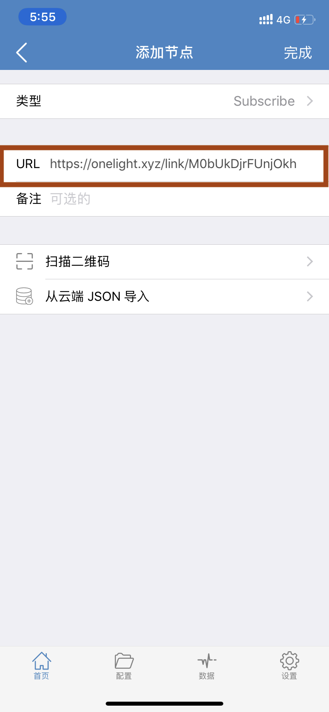
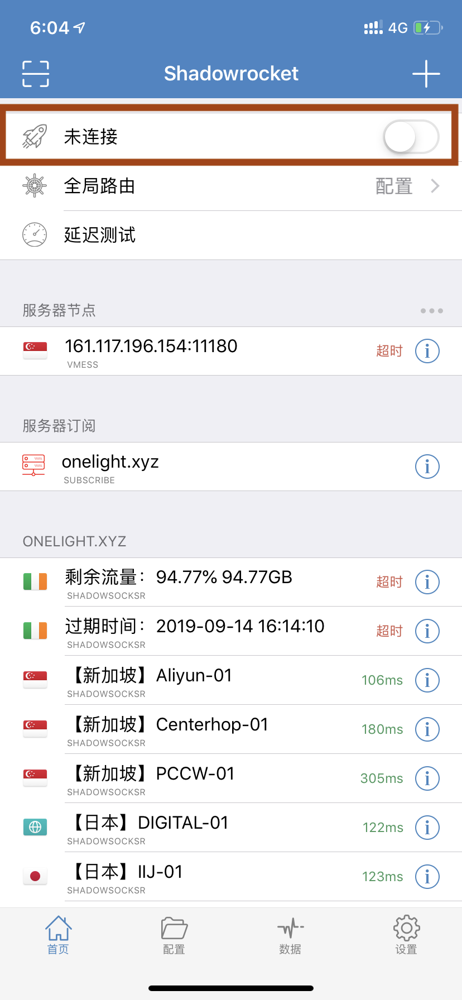
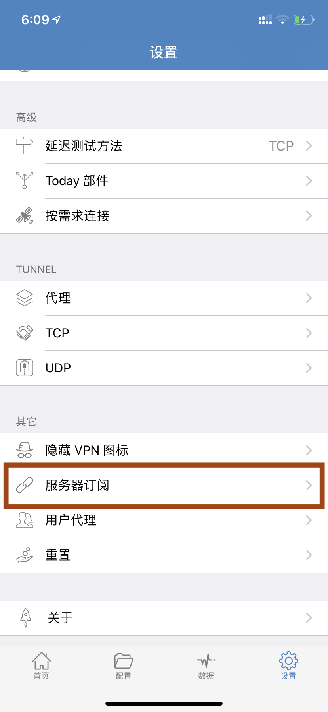
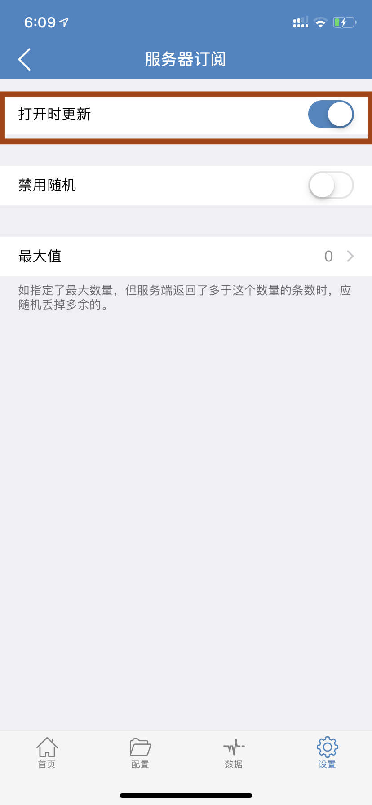

# IOS 教程

| 系统要求： | iOS 9.0及以上  |
| :--- | :--- |
| 设备要求： | iPhone、iPad & iPod touch |

## 配置订阅节点及使用教程

完成以下三个简单配置步骤，即可享用Onelight云服务。\(阁下可能需要花5~10分钟左右的时间完成教程\)

### 一 .请使用浏览器打开 _OneLight_ 用户中心 - 下载软件并复制订阅地址

#### [传送onelight官网](https://onelight.cloud/user) [https://onelight.cloud](https://onelight.cloud/user)

* 此软件已从国区 App Store 下架，请自备账户或使用我们提供的账号从非国区下载
* 复制订阅地址，置客户端时需使用。


订阅地址包含您的订阅信息，阁下应把它当作密码一样妥善保存，请勿泄露给他人！


### 二. 节点配置

* 打开 Shadowrocket 点击右上角的 加号

* 点击选择类型

* 选择Subscribe类型

* 粘贴从Onelight官网复制的订阅地址并点击完成

* 选择任意带有国家名称的节点，并点击上面“未连接“按钮 进行连接。
* 全局路由选择默认配置即可
* 可以点击延迟测试挑选合适自己的线路

### 建议自动更新节点功能 方便获取最新线路

### 您现在可以享受Onelight云服务带来的全新互联网体验

