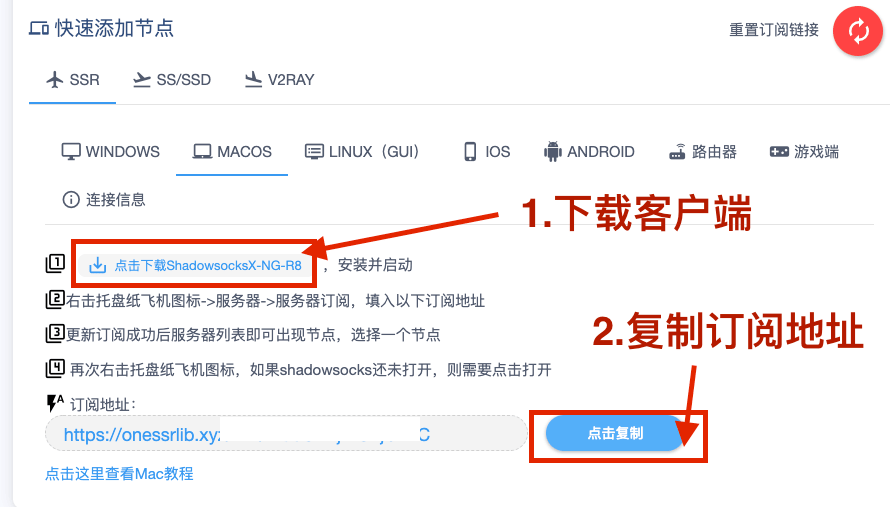
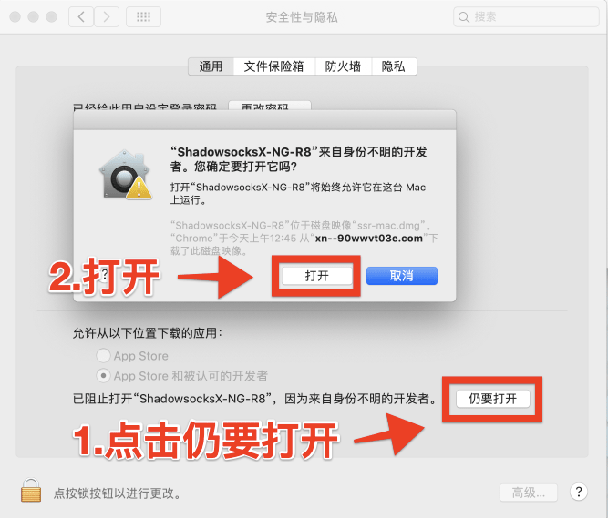
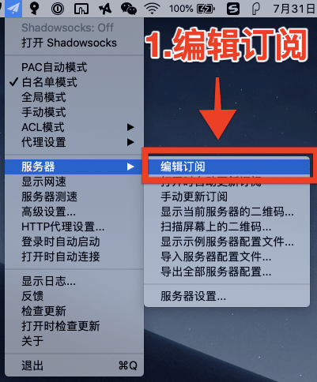
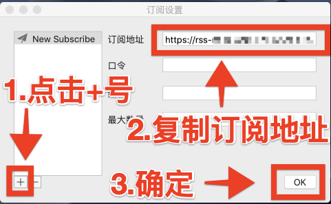
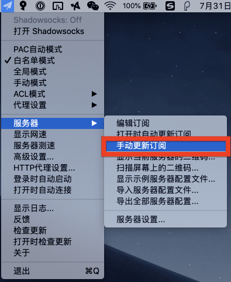

# Mac 教程

| 系统要求：  | Mac OSX |
| :--- | :--- |
| 软件版本：  | ShadowsocksX-NG-R8 |
| 设备要求：  | MacBook / iMac / Mac Pro |

### 1.请使用浏览器打开 海豚湾 用户中心 - 查看快速添加节点

* 点击下载 MacOS 客户端文件并安装。
* 复制订阅地址，配置客户端时需使用。


订阅地址包含您的订阅信息，阁下应当把它当做密码一样妥善保管，请勿泄露给他人！


### 2.打开 ShadowsocksX-NG-R8 客户端

* 为了方便下次使用,建议将软件复制到finder的应用程序中或桌面上

* 点击任务栏纸飞机图标
* 选择 服务器 - 编辑订阅

### 3.配置订阅地址

* 点击 + 号
* 将复制的订阅地址粘贴到订阅地址栏
* OK确定

### 4.更新订阅

* 点击手动更新订阅


一小段时间后（具体时间取决于您的网络环境），您将会收到 **服务器订阅更新成功** 的通知消息，同时查看服务器列表也可以看到对应的 海豚湾 接入点。


* 提示成功更新订阅


如果订阅失败，可尝试将本地DNS地址改为114.114.114.114 和 119.29.29.29 并重试更新。


* 点击任务栏的纸飞机图标 「OneLight」中选择节点使用
* 请注意模式使用 **白名单** 或 **全局**

